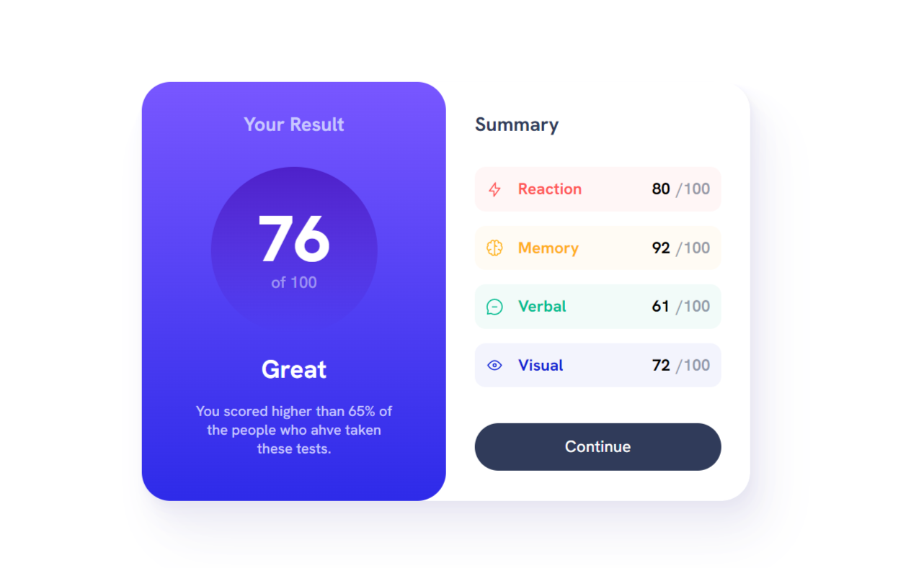

## Welcome! 👋

Thanks for checking out this front-end coding challenge.

[Frontend Mentor](https://www.frontendmentor.io) challenges help you improve your coding skills by building realistic projects.

# Frontend Mentor - Results summary component solution

This is a solution to the [Results summary component challenge on Frontend Mentor](https://www.frontendmentor.io/challenges/results-summary-component-CE_K6s0maV). Frontend Mentor challenges help you improve your coding skills by building realistic projects. 

## Table of contents

- [Overview](#overview)
  - [The challenge](#the-challenge)
  - [Screenshot](#screenshot)
  - [Links](#links)
- [My process](#my-process)
  - [Built with](#built-with)
  - [What I learned](#what-i-learned)
  - [Continued development](#continued-development)
  - [Useful resources](#useful-resources)
- [Author](#author)
- [Acknowledgments](#acknowledgments)

## Overview

### The challenge

Users should be able to:

- View the optimal layout for the interface depending on their device's screen size
- See hover and focus states for all interactive elements on the page

### Screenshot

### Links

- Solution URL: [Add solution URL here](https://www.frontendmentor.io/solutions/simple-solution-for-simple-layout-O6Q_bynzgz)
- Live Site URL: [Add live site URL here](https://cgm-thanhtike.github.io/Results-summary-frontend-mentor-simple-solution/)

## My process

- First I analyze the deisgn
- Thinking the easiest way for layout like using flex box and grid
- I made custom properties for color and background etc..
- I used rem units for all font-size and paddings for flexiblity
- I'm using desktop first approach because the mobile view is simple and easy to achieve

### Built with

- Semantic HTML5 markup
- CSS custom properties
- Flexbox
- CSS Grid

### What I learned

I have learnt how to make a beautiful card design

## Author

- Website - [Than Htike](https://github.com/CGM-ThanHtike)
- Frontend Mentor - [@thanhtike](https://www.frontendmentor.io/profile/CGM-ThanHtike)

**Thank you all!** 🚀
